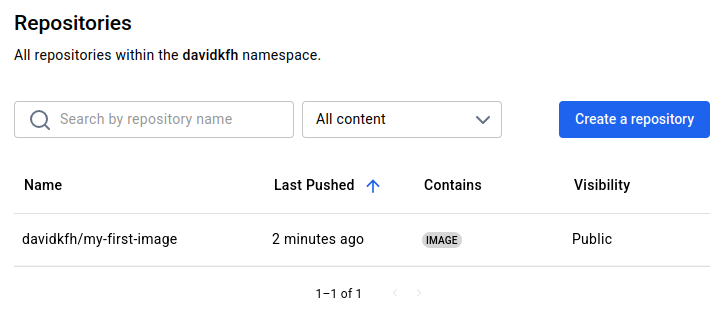
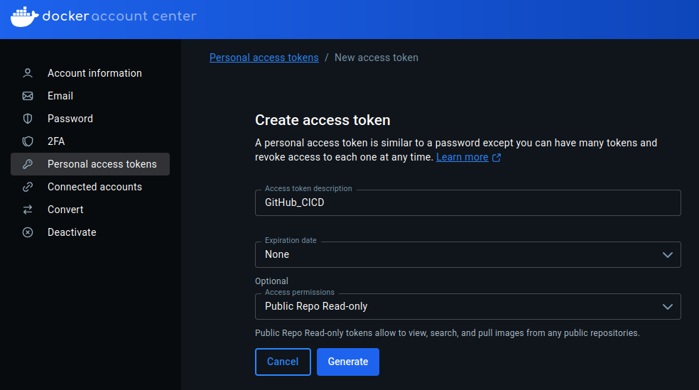
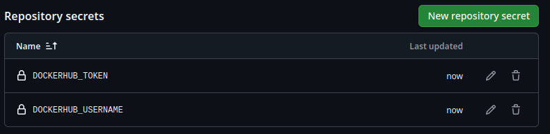
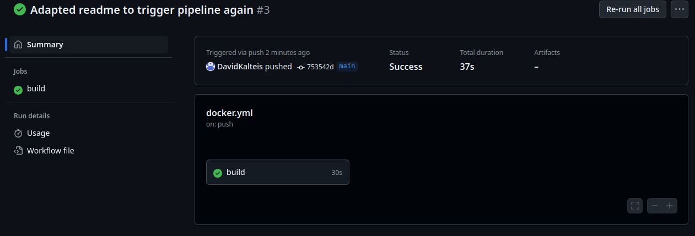
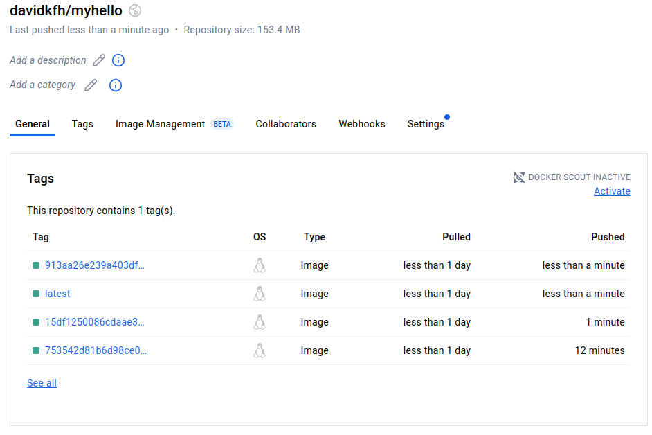
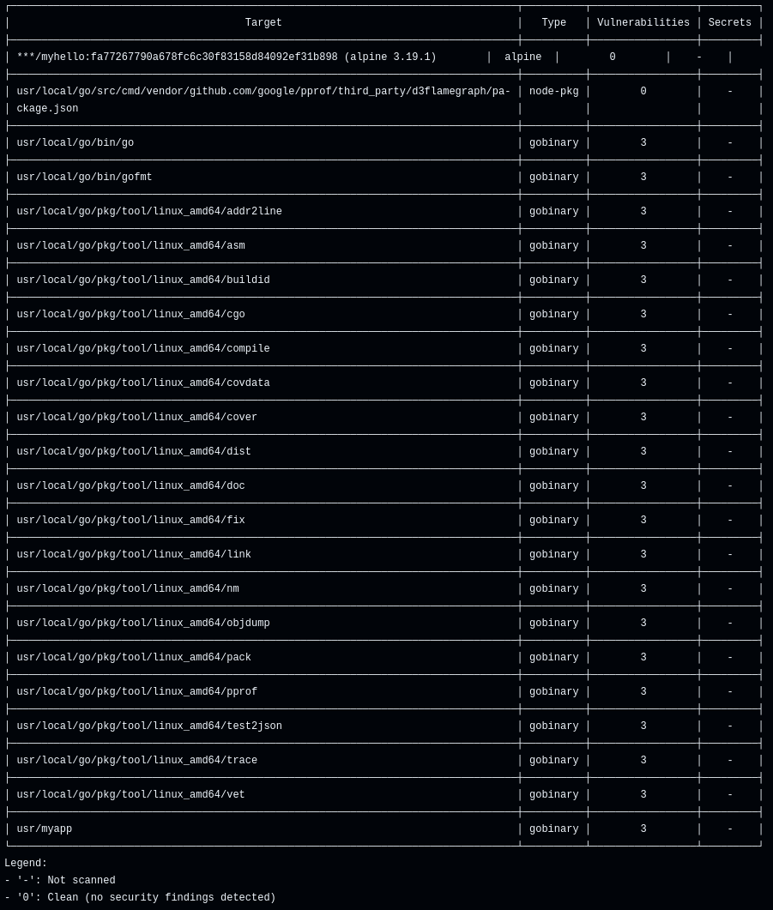

> [!NOTE]
> All the files can be found in my public GitHub repository: https://github.com/DavidKalteis/cicd_ex4

# Part 1
## Clone repositor

```bash
git clone https://github.com/mrckurz/cd2020-ex04.git
```
## Check correct go installation

**Start main file**
```bash
go run main.go 
```

**Successful respond for localhost:8888**
```bash
curl localhost:8888

Hello, it is 15:21
```

**Test passes**
```bash
go test -v 

=== RUN   TestGetMinuteUp
--- PASS: TestGetMinuteUp (0.00s)
=== RUN   TestGetMinuteDown
--- PASS: TestGetMinuteDown (0.00s)
PASS
ok  	github.com/DavidKalteis/cicd/ex3/cd2020-ex04	0.002s
```

**Added label to dockerfile (MAINTAINER is depreciated and LABLE should be used instead)**
```
LABEL author="s2410455001@fhooe.at"
```

**Build the docker image** 
```bash
docker image build -f Dockerfile -t davidkfh/my-first-image:0.0.1 ./
```

**and view the built one (3rd line):**

```bash
docker images

REPOSITORY                  TAG       IMAGE ID       CREATED         SIZE
cicd-jenkins                latest    6b16002443dc   11 days ago     563MB
postgres                    latest    f49abb9855df   2 months ago    438MB
davidkfh/my-first-image     0.0.1     56349b2c27f8   15 months ago   255MB
jupyter/pyspark-notebook    latest    384d65133c51   19 months ago   4.86GB
confluentinc/cp-kafka       6.2.0     6b8633010002   3 years ago     772MB
confluentinc/cp-zookeeper   6.2.0     3cf98185738a   3 years ago     772MB
```

**login to docker via CLI:**

```bash
docker login -u davidkfh                                                         

i Info → A Personal Access Token (PAT) can be used instead.
         To create a PAT, visit https://app.docker.com/settings
         
         
Password: 

WARNING! Your credentials are stored unencrypted in '/home/david/.docker/config.json'.
Configure a credential helper to remove this warning. See
https://docs.docker.com/go/credential-store/

Login Succeeded
```

**Push to dockerhub:**
```bash
docker image push davidkfh/my-first-image:0.0.1                                                                 
The push refers to repository [docker.io/davidkfh/my-first-image]
5f70bf18a086: Mounted from library/golang 
00168ea4cecf: Mounted from library/golang 
f89b05d5c0b7: Mounted from library/golang 
6dd5a23a5acc: Mounted from library/golang 
d4fc045c9e3a: Mounted from library/golang 
0.0.1: digest: sha256:48850eac9f79901ba2d536779f4d4603a8878dd17e8fa2fd7a3f4557e92e464f size: 1364
```

**Verified on https://hub.docker.com/repositories/davidkfh** 


# Part 2

**adapted Docker file:**

```dockerfile
FROM golang:1.20-alpine
LABEL author="s2410455001@fhooe.at"
WORKDIR /src
COPY . .
RUN ls -la
RUN go build -o /usr/myapp main.go
EXPOSE 8888
CMD ["/usr/myapp"]
```

**build image:**

```bash
docker image build -t davidkfh/myhello:0.0.1 ./
```

**run container:**
```bash
docker container run -p 9090:8888 davidkfh/myhello:0.0.1 
```

**Check running container:**
```bash
docker ps                                                                        
CONTAINER ID   IMAGE                    COMMAND        CREATED         STATUS         PORTS                                         NAMES
9be1e5dd2d34   davidkfh/myhello:0.0.1   "/usr/myapp"   9 minutes ago   Up 9 minutes   0.0.0.0:9090->8888/tcp, [::]:9090->8888/tcp   peaceful_chebyshev
```

**Check ports:**
```bash
curl localhost:8888                                                              
curl: (7) Failed to connect to localhost port 8888 after 0 ms: Couldn't connect to server
```

```bash
curl localhost:9090                                                                                           
Hello, it is 14:8%                                                
```

**stop the container:**
```
docker stop peaceful_chebyshev
```
# Part 3

**For this part, i created a new GitHub repository and moved the files from the previous parts there -> https://github.com/DavidKalteis/cicd_ex4**
**Generate docker access token https://app.docker.com/settings/personal-access-tokens/create**



> [!IMPORTANT]
>The scope has to be set to Read & Write in order to push images

**Add token to GitHub secrets** 



**Trigger pipeline with commit:**
The pipeline can be found in the public repository [here](https://github.com/DavidKalteis/cicd_ex4)



**Veryfied on [Dockerhub](https://hub.docker.com/repository/docker/davidkfh/myhello/general)**



# Part 4

**Added Trivy to GitHub pipeline:**
```yml
scan:
    runs-on: ubuntu-latest
    needs: build

    steps:
    - name: Checkout code
      uses: actions/checkout@v3

    - name: Trivy Image Scan
      uses: aquasecurity/trivy-action@master
      with:
        image-ref: ${{ secrets.DOCKERHUB_USERNAME }}/myhello:${{ needs.build.outputs.image-tag }}
        format: 'table'
        exit-code: '1'
        ignore-unfixed: true
        vuln-type: 'os,library'
        severity: 'CRITICAL,HIGH'
        scan-type: image


    - name: Trivy FS Scan (source & Dockerfile)
      uses: aquasecurity/trivy-action@master
      with:
        scan-type: 'fs'
        scan-ref: '.'
        format: 'table'
        exit-code: '1'
        ignore-unfixed: true
        vuln-type: 'os,library'
        severity: 'CRITICAL,HIGH'
```

**The pipeline will not succeed due to found vulnerabilities in go. Details can be found in the pipeline logs of the repository. https://github.com/DavidKalteis/cicd_ex4/actions/runs/15086341171/job/42409335201** 


